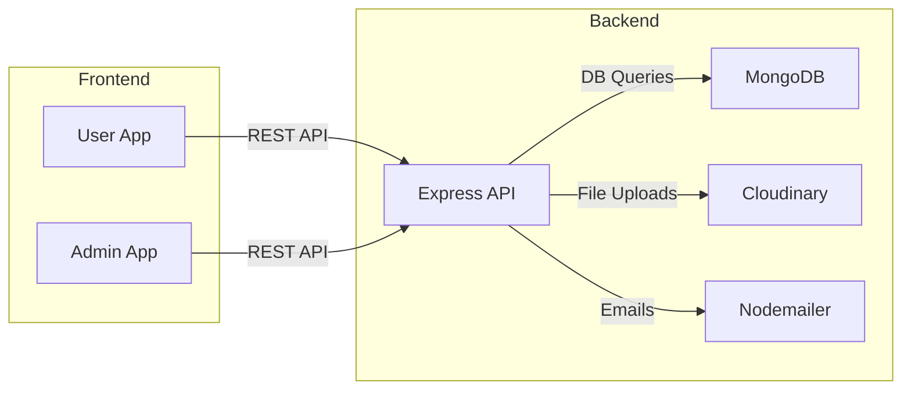

# InkDesk

**Live Demo:** [https://inkdesk-frontend.onrender.com](https://inkdesk-frontend.onrender.com)

---

## Overview

InkDesk is a modern, full-stack e-commerce platform for stationery, office, art, and craft supplies. It features a robust user experience, a powerful admin dashboard, and a scalable backend. The project is built with React (Vite), Node.js/Express, and MongoDB, and is designed for both end-users and administrators.

---

## Features

- **Comprehensive Product Catalog:** Browse, search, and filter products by category, subcategory, brand, price, and stock.
- **Dynamic Home Page:** Hero banners, featured categories, trending products, and promotional sections.
- **Advanced Cart & Wishlist:** Add, update, and remove items; persistent cart and wishlist for logged-in users.
- **Secure Authentication:** JWT-based login, registration, email verification, and password reset for users and admins.
- **Order Management:** Place orders, track status, view order history, and receive email notifications.
- **Checkout Experience:** Multi-step checkout with shipping, payment, and order review.
- **User Profile:** Manage personal details, addresses, and view past orders.
- **Product Reviews:** Write and read reviews, with average ratings displayed.
- **Blog & Content:** Educational and promotional blog posts to engage users.
- **Contact & Support:** Contact form with backend email integration.
- **Admin Dashboard:** Manage products, categories, banners, users, orders, and reviews with analytics and charts.
- **Bulk Actions:** Admins can perform bulk updates and deletions.
- **Stock & Sales Analytics:** Visualize sales, low-stock alerts, and top products.
- **Mobile Responsive:** Fully responsive UI with Tailwind CSS and FontAwesome icons.
- **Robust API:** RESTful endpoints for all resources, with filtering, pagination, and search.
- **Role-Based Access:** Strict separation of user and admin privileges.
- **Cloudinary Integration:** Image uploads and management for products and banners.
- **Email Notifications:** Order confirmations, password resets, and contact responses via Nodemailer.
- **Error Handling:** Global error boundaries and user-friendly feedback.
- **Performance Optimizations:** Skeleton loaders, code splitting, and efficient state management.
- **Environment Configurable:** Easily switch between local and cloud deployments.

---

## User Types

- **User:** Can browse, search, and purchase products, manage cart/wishlist, write reviews, and update their profile.  
  _Users also have read-only access to the admin panel—this allows non-admin users to explore and experience the admin dashboard without admin credentials. This feature was implemented so everyone can view the dashboard, as admin credentials can not be shared._
- **Admin:** Has all user privileges plus access to the admin dashboard for managing products, categories, banners, users, orders, and site content.

---

## Access Control

- **Public:** Home, product listing, product details, blogs, about, contact, login/register.
- **User (Authenticated):** Cart, wishlist, checkout, order history, profile, reviews.
- **Admin (Authenticated + Role):** Admin dashboard, product/category/banner/user/order management.
- **Route Protection:** Enforced via React Context (frontend) and Express middleware (backend).

---

## Project Structure

```
InkDesk/
│
├── admin/           # Admin frontend (React, Vite)
│   ├── src/
│   │   ├── Components/
│   │   ├── Context/
│   │   └── ...
│   ├── public/
│   └── ...
│
├── frontend/        # User frontend (React, Vite)
│   ├── src/
│   │   ├── Components/
│   │   ├── Context/
│   │   └── ...
│   ├── public/
│   └── ...
│
├── backend/         # Node.js/Express API
│   ├── controllers/
│   ├── middleware/
│   ├── models/
│   ├── routes/
│   ├── config/
│   └── ...
│
├── Readme.md        # Project documentation
└── ...
```

---

## Architecture



---

## Setup & Installation

### Prerequisites

- Node.js (v18+ recommended)
- npm or yarn
- MongoDB instance (local or cloud)

### 1. Clone the Repository

```sh
git clone https://github.com/Shreyanshu20/InkDesk
cd InkDesk
```

### 2. Install Dependencies

#### Backend

```sh
cd backend
npm install
```

#### Frontend (User)

```sh
cd ../frontend
npm install
```

#### Admin Frontend

```sh
cd ../admin
npm install
```

### 3. Configure Environment Variables

Create a `.env` file in the `backend/` directory with the following:

```
PORT=5000
MONGO_URL=your_mongodb_uri
JWT_SECRET=your_jwt_secret
CLOUDINARY_CLOUD_NAME=your_cloud_name
CLOUDINARY_API_KEY=your_api_key
CLOUDINARY_API_SECRET=your_api_secret
SMTP_USER=your_smtp_email
SMTP_PASS=your_email_password
SENDER_EMAIL=your_email
FRONTEND_URL=https://inkdesk-frontend.onrender.com
ADMIN_URL=https://inkdesk-admin.onrender.com
```

### 4. Run the Applications

#### Backend

```sh
cd backend
nodemon index.js
```

#### Frontend (User)

```sh
cd ../frontend
npm run dev
```

#### Admin Frontend

```sh
cd ../admin
npm run dev
```

---

## Deployment

- **Frontend (User):** [https://inkdesk-frontend.onrender.com](https://inkdesk-frontend.onrender.com)
- **Admin:** [https://inkdesk-admin.onrender.com](https://inkdesk-admin.onrender.com)
- **Backend API:** [https://inkdesk-backend.onrender.com](https://inkdesk-backend.onrender.com)

---

## Contact

For questions or support, open an issue or contact the maintainer at [shreyanshudhawale2@gmail.com](mailto:shreyanshudhawale2@gmail.com).

---
